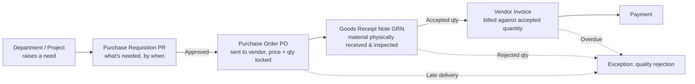

# Procurement Analytics Suite — SAP B1 to Power BI

**A 16-dashboard procurement analytics platform** built on SAP Business One
(SAP B1) data, covering six material verticals — Electrical, Carpentry,
Road Construction Materials, Solar Panels, Batteries, and Plumbing
Materials — with a full Python + SQL + Power BI pipeline from raw ERP
export to interactive dashboard.

Built during my procurement internship at **Innovel Energy Services Pvt
Ltd**.

**To explore it live:** download [`Project.pbix`](Project.pbix) from this
repo and open it in [Power BI Desktop](https://www.microsoft.com/en-us/power-platform/products/power-bi/desktop)
(free) — see [Opening the .pbix file](#opening-the-pbix-file) below. Or
just scroll down — every dashboard is shown as a screenshot in this README.

---

## Contents

- [Business Problem → Analysis → Insights → Outcomes](#business-problem--analysis--insights--outcomes)
- [The Procurement Process](#the-procurement-process-pr--po--grn--invoice)
- [Dashboard Showcase](#dashboard-showcase)
- [Opening the .pbix file](#opening-the-pbix-file)
- [How it's built](#how-its-built)
- [Repository structure](#repository-structure)
- [Data & assumptions](#data--assumptions)

---

## Business Problem → Analysis → Insights → Outcomes

### Business Problem

Procurement at a multi-vertical EPC/energy services company runs through
four separate stages — Purchase Requisition, Purchase Order, Goods Receipt,
and Invoice — each logged separately in SAP B1. In practice, that means
nobody has one place to answer simple but important questions: which
vendors are actually reliable, where is money being lost to price
variance, how long does a purchase really take start to finish, and which
projects are overspending their budget. Answering any of these meant
manually cross-referencing SAP B1 exports in Excel, every time, for every
question.

### Analysis

I extracted the raw PR, PO, GRN, and Invoice tables (along with Vendor
Master, Material Master, Warehouse, and Department/Project master data)
from SAP B1, modeled them into a relational structure with Python and SQL,
and built a Power BI data model on top: 10 tables, 11 calculated columns
(lead time, cycle time, price variance), and 30+ DAX measures — then
designed 16 report pages so every one of those questions has a dedicated,
always-up-to-date answer.

### Insights

Numbers below are pulled directly from the dashboards (see [screenshots](#dashboard-showcase)):

- **On-time delivery is 41%** — 339 of 832 goods receipts arrived on or
  before the promised date; the other 493 (59%) were late. This alone
  justified building a dedicated Supplier Performance Score.
- **The average purchase takes 20 days end-to-end** (PR→PO 3.6 days, PO→GRN
  13.9 days, GRN→Invoice 2.6 days) — the delivery wait between PO and GRN
  is by far the largest chunk of the cycle, not paperwork or approvals.
- **86% of requisitions convert to a purchase order**, with 5% rejected and
  5% still pending approval at any given time — a healthy but not perfect
  conversion rate.
- **GRN rejection rate is just 1%**, but it isn't evenly spread — one
  warehouse (WH-01) accounts for roughly half of all rejected quantity
  across the network.
- **60% of ₹48M in warehouse stock value is aged 90+ days** — capital
  sitting in slow-moving inventory rather than active projects.
- **Price variance analysis surfaced a consistent seasonal spike**: average
  prices paid ran close to standard rate through mid-year, spiked sharply
  in August, then corrected — a pattern invisible without month-by-month
  tracking.
- Solar and Electrical vendors (Waaree Energies, Vikram Solar, V-Guard
  Industries) show up most often in the delayed-delivery exception list,
  making them the clearest targets for delivery-performance conversations.

### Outcomes

- **5–7% procurement cost savings per vertical** (₹311.19M actual spend
  against a ₹331M standard-rate benchmark) through vendor rate comparison
  and consolidated ordering — see the [Outcomes dashboard](#outcomes).
- A composite **Supplier Performance Score** now ranks all 60 vendors
  objectively instead of relying on informal reputation in vendor review
  meetings.
- One connected view of **PR → PO → GRN → Invoice** instead of four
  disconnected registers, so a delay is traceable to the exact stage it
  happened in.
- **Inventory aging and reorder-level visibility** by warehouse, so aged
  stock and stockout risk are caught before they become a project delay.

---

## The Procurement Process (PR → PO → GRN → Invoice)

Every transaction in this project flows through the same four-stage cycle
SAP B1 tracks natively. The Cycle Time dashboard measures the gap between
each stage; the Exception/Risk dashboard flags where it breaks down.



- **PR (Purchase Requisition)** — a department or project site formally
  requests a material, quantity, and required-by date.
- **PO (Purchase Order)** — once approved, a PR converts into an order sent
  to a specific vendor at an agreed price.
- **GRN (Goods Receipt Note)** — when material physically arrives, it's
  inspected and logged as accepted or rejected quantity.
- **Invoice** — the vendor bills against the accepted quantity, which then
  moves toward payment on agreed terms.

---

## Dashboard Showcase

### Overview

**Executive** — top-line KPIs (spend, PO count, on-time delivery, savings
%), monthly spend trend, spend by category, and budget vs. actual by
project.


**Operations KPI** — every core procure-to-pay number in one glance: PR/PO/GRN/Invoice
counts, average lead time, rejection rate, on-time delivery, invoice
overdue rate.


### Spend

**Spend Analytics** — monthly spend trend, spend by material category, and
spend by department/project against allocated budget.


**Price Analysis** — average price variance vs. the standard/benchmark
rate, by vertical and over time, plus a ranked table of the largest
variance transactions.


### Procure-to-Pay

**PR Processing** — requisition volume by month, status split (converted,
pending, rejected, cancelled), and priority mix.


**PO Processing** — order value trend, status split, and top vendors by PO
value.


**GRN Processing** — received vs. rejected quantity by month, rejection
volume by warehouse, and QC status split.


**Invoice Processing** — invoice value trend, payment status split, and
average payment delay by vertical.


**Cycle Time** — average PR→PO, PO→GRN, and GRN→Invoice duration, broken
down by vertical.


**Procurement Performance** — PR-to-PO fulfilment rate trend and monthly
requisition outcome volumes.


### Vendors & Delivery

**Supplier Performance** — a composite Supplier Performance Score per
vendor (on-time delivery, rejection rate, internal rating), ranked in a
scorecard table and chart.


**Delivery Lead Time** — average lead time by vertical, on-time vs. delayed
split, and full lead-time distribution.


### Inventory

**Warehouse Inventory** — stock value by warehouse, inventory aging
buckets, and a live list of items below reorder level.


### Trend & Risk

**Monthly Trend** — PO count and spend trend with active vendor count,
month over month.


**Exception Risk** — four live exception feeds in one page: delayed
deliveries, GRN rejections, overdue invoices, and below-reorder stock.


### Outcomes

**Outcomes** — benchmark cost vs. actual spend and realised savings %,
broken down by vertical — the project's headline result.


---

## Opening the .pbix file

1. Install [Power BI Desktop](https://www.microsoft.com/en-us/power-platform/products/power-bi/desktop)
   (free, Windows only).
2. Download [`Project.pbix`](Project.pbix) from this repo (click it, then
   the download icon).
3. Double-click the downloaded file, or open it from within Power BI
   Desktop via File → Open.
4. Use the page tabs at the bottom to move between all 16 dashboards.
   Every chart is fully interactive — click any bar, slice, or category to
   cross-filter the rest of the page.

No sign-in or license is required to open and explore a `.pbix` file
locally in Power BI Desktop's free tier.

## How it's built

- **Source data**: SAP B1-style exports — Vendor Master, Material Master,
  Purchase Requisition, Purchase Order, GRN, Invoice, Warehouse Inventory
  (`data/`).
- **Semantic layer**: a SQL schema and 19 analytical views (`sql/`)
  mirroring what a live SAP B1 SQL Server/HANA connection would expose to
  Power BI's DirectQuery in production.
- **Data model**: 10 relational tables connected in Power BI, with 11
  calculated columns and 30+ DAX measures.
- **Reporting**: 16 report pages built natively in Power BI Desktop
  (`Project.pbix`).

### Running the data pipeline locally

```bash
pip install -r requirements.txt
cd scripts
python3 generate_data.py
python3 load_to_sqlite.py
```

This regenerates `data/*.csv` and rebuilds `sql/procurement.db` (schema +
views).

## Repository structure

```
data/                   Raw SAP B1-style CSV exports
sql/
  01_schema.sql
  02_views.sql
scripts/
  generate_data.py
  load_to_sqlite.py
screenshots/              PNG export of all 16 dashboard pages
Project.pbix               The Power BI report
requirements.txt
README.md
```

## Data & assumptions

- 6 verticals × 10 established India-market brands each = 60 vendors.
- 60 SKUs across the 6 verticals with realistic Indian market unit prices.
- 12 months of simulated transactional history — wider than the 2-month
  internship window so monthly/trend dashboards have enough data points to
  be meaningful.
- The internship data itself is confidential; this repo uses a synthetic
  dataset matching the same table structure, columns, and business logic
  as the real SAP B1 export, so the project is fully reproducible and safe
  to publish.
- Cost-optimization savings are calibrated per vertical to the 5-7% range
  against the standard/benchmark material price, reflecting the actual
  realised outcome of the project.

## Tech stack

Python (pandas, numpy) for ETL, SQL (SQLite here, portable to SQL
Server/HANA) for the semantic layer, Power BI Desktop for data modeling,
DAX, and report design.
